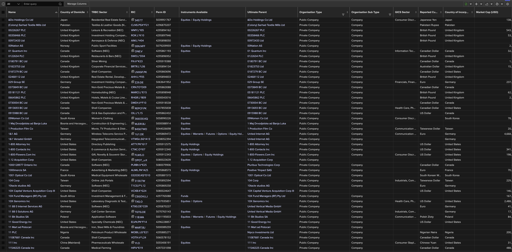
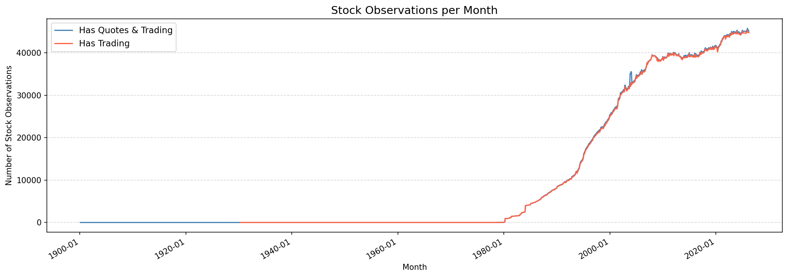
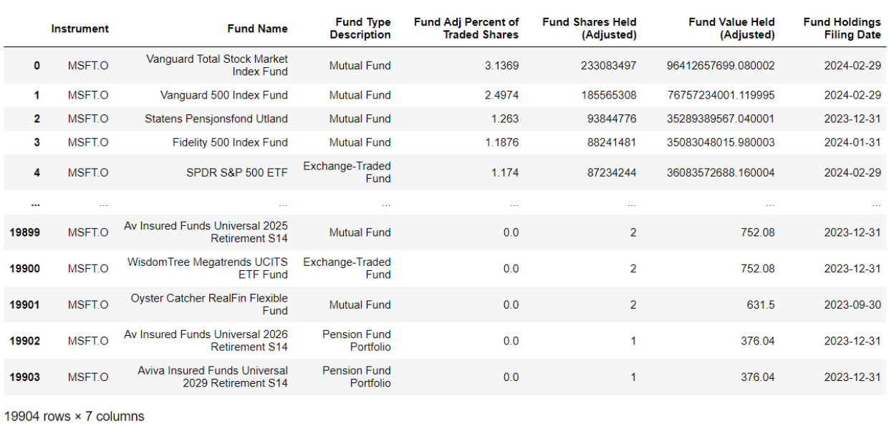
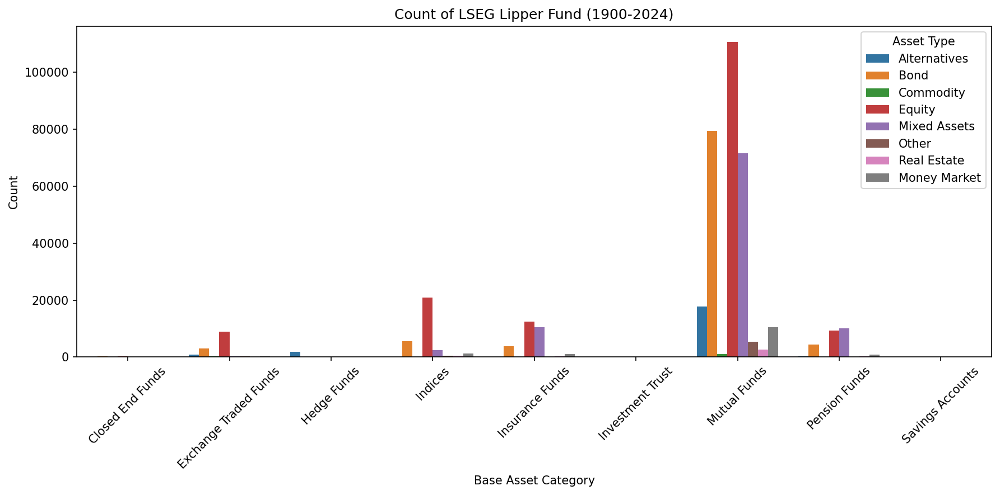
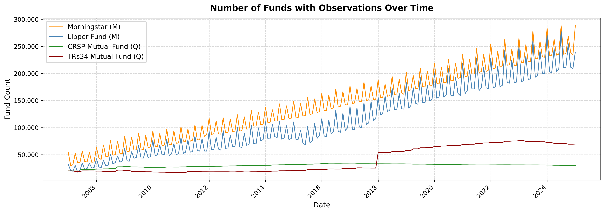

# LSEG Database Overview

This repository provides a search database for quick lookup of companies covered in the **London Stock Exchange Group (LSEG)** database. The data includes company-level identifiers and attributes that can be used to locate, match, and retrieve records across datasets using LSEG's native identifiers.

---

## Overview of Companies & Issuers [Database](https://huggingface.co/datasets/JunHe-S/LSEG/tree/main)

The database offers a structured overview of **27,327,868** companies available in LSEG, including their key identifiers, organisational metadata, instrument counts, and market information. It is intended to serve as a reference and crosswalk table for researchers and practitioners who need to quickly locate a company's LSEG identifiers before conducting further data retrieval or analysis. 



Here is instruction how to download data from database in `Huggingface`:

```python
import duckdb
from huggingface_hub import hf_hub_download

# Download to local cache (only first time)
# Save to a specific folder instead of default cache
path = hf_hub_download(
    repo_id="junhe-S/LSEG",
    filename="companies.parquet",
    repo_type="dataset",
    local_dir="./data"          # saves to ./data/companies.parquet
)
# Query with DuckDB
con = duckdb.connect()
df = con.execute(f"SELECT * FROM parquet_scan('{path}') LIMIT 10").df()
```

The database covers **113,200** **listed and delisted** companies in LSEG, where **97,341** (**95,916**) firms have valid stock data (stock trading data). However, LSEG classification classify companys with mistakes. For example, `Alibaba Health Information Technology Ltd` is classfied as bank/financial institution.



Since we have collected `OAPermID` or `RIC` for each listed and delisted companies, we can download firms' global ownership, which starts from 1997, by referring to this [documentation](https://developers.lseg.com/en/article-catalog/article/the-data-library-for-python-quick-reference-guide-access-layer) and [python module](https://pypi.org/project/lseg-data/). 

```python
import lseg.data as ld 
ld.open_session()
fields = ['TR.FundPortfolioName','TR.FundInvestorType','TR.FdAdjPctOfShrsOutHeld',
          'TR.FundAdjShrsHeld','TR.FdAdjSharesHeldValue','TR.FundHoldingsDate']
 
own = ld.get_data('MSFT.O', fields,{'SDate':-25,'EDate':-24,'Frq':'D'})
own = own[own["Fund Shares Held (Adjusted)"]!=0].reset_index(drop=True)
own
```



**Notice**: LSEG provided all of data on WRDS, which requires extra subscription. Meanwhile, WRDS-13F, which mainly focus on the US market, should provide more data since it starts from 1978. Recently, [Which Investors Drive Anomaly Returns and How? (2026, JFE)](https://www.sciencedirect.com/science/article/pii/S0304405X26000280) applies this in their paper.


## Overview of LSEG Lipper Fund [Database](https://huggingface.co/datasets/JunHe-S/LSEG/tree/main)

**Between 1900 and 2024, the dataset encompasses 943,096 funds across a broad range of investment vehicles.** The vast majority are Mutual Funds, which account for 750,218 entries, followed by Insurance Funds at 60,677 and Pension Funds at 50,877. Exchange Traded Funds (ETFs) number 43,249, while Hedge Funds make up 20,662 of the total. 



Here is instruction how to download data from database in `Huggingface`:

```python
import duckdb
from huggingface_hub import hf_hub_download

# Download to local cache (only first time)
# Save to a specific folder instead of default cache
path = hf_hub_download(
    repo_id="junhe-S/LSEG",
    filename="lipper_fund.parquet",
    repo_type="dataset",
    local_dir="./data"          # saves to ./data/lipper_fund.parquet
)
# Query with DuckDB
con = duckdb.connect()
df = con.execute(f"SELECT * FROM parquet_scan('{path}') LIMIT 10").df()
```

However, lipper funds are available from **December-2006** and funds report in different frequency. 



Here is instruction how to download data from database in `Huggingface`:

```python
import duckdb
from huggingface_hub import hf_hub_download

# Download to local cache (only first time)
# Save to a specific folder instead of default cache
path = hf_hub_download(
    repo_id="junhe-S/LSEG",
    filename="lipper_fund_holdings.parquet",
    repo_type="dataset",
    local_dir="./data"          # saves to ./data/lipper_fund.parquet
)
# Query with DuckDB
con = duckdb.connect()
df = con.execute(f"SELECT * FROM parquet_scan('{path}') LIMIT 10").df()
```

## Overview of LSEG EMAXX / Bond Mutual Fund [Database](https://huggingface.co/datasets/JunHe-S/LSEG/tree/main)

Since many institutions have no budget for `emaxx` database,  Lipper Fund is a good alternative database as it provides info of `bonds` held by these institutions. Although LESG provides snap of bond ownership, it is only front-edge data and can not be extracted from API. However, if you visit [Emaxx Columbia](https://www.columbia.edu/acis/eds/holdings/1013/www1-data.pl@C1013.html), you will find that many info before 2007 is missing if we utilite data from lipper fund only. 

```python
# Overview of Bonds included in Emaxx duing 2000-2024 (... matured before 2025)
import duckdb
from huggingface_hub import hf_hub_download

# Download to local cache (only first time)
# Save to a specific folder instead of default cache
path = hf_hub_download(
    repo_id="junhe-S/LSEG",
    filename="emaxx.parquet",
    repo_type="dataset",
    local_dir="./data"          # saves to ./data/emaxx.parquet
)
# Query with DuckDB
con = duckdb.connect()
df = con.execute(f"SELECT * FROM parquet_scan('{path}') LIMIT 10").df()
```

Alternatively, `MorningStar` also provides information from bond mutual fund. In paper, [Bond Price Fragility and the Structure of the Mutual Fund Industry](https://academic.oup.com/rfs/article/37/7/2063/7633431?login=false), they mainly use taxable fixed-income mutual funds as bond mutual fund while paper, [Bond Funds and Credit Risk](https://papers.ssrn.com/sol3/papers.cfm?abstract_id=3490683) define bond mutual funds in different way. Both papers mainly focus on a total of 1,405 funds.

## Overview of LSEG SDC [Youtube](https://www.youtube.com/watch?v=U1qXURAAHKE)

Although it is provided in WRDS, many institutions do not have enough budget for it (including mine). Alternatively, you can download it from SEC platform on LSEG Workspace ( ... maybe need subscription). SDC provides databases including M&A, Bonds Issuance, (syndicated) Loans and IPO, which are popular in Academia. The information is almost the same as ones In `search` section but SDC provides more detailed records.

**Notice**: Loan Dealscan Database on WRDS can connect with LSEG directly via `PermID` code and I notice that many researchers ignore this fact. 

## Overview of LSEG Bond/Trace [Database](https://huggingface.co/datasets/JunHe-S/LSEG/tree/main)

Although it is provided in WRDS, many institutions do not have enough budget for it (including mine). Alternatively, you can inspect some information from LSEG, which provides up to 3-month Trace data and all quote information.

```python
import datetime
import refinitiv.data as rd   # pip install refinitiv.data
rd.open_session()

df = rd.get_history(
    universe=["67066GAE4="], # NVDA 3.200 16-SEP-2026 '26
    fields=[
            "BID_YIELD",  #Bid Yield,
            "BID",        #Bid,
            "ASK_YIELD",  #Ask Yield,
            "ASK",        #Ask,
            "MID_PRICE",  #Mid Price,
            "OAS",        #Option Adjusted Spread,
            "SWAP_SPRD",  #Swap Spread,
            "AST_SWPSPD", #Asset Swap Spread,
            "BMK_SPD",    #Benchmark Spread,
            "ISMA_B_YLD", #ISMA Bid Yield,
            "ISMA_A_YLD", #ISMA Ask Yield,
            "BPV",        #Basis Point Value,
            "CDS_BASIS",  #CDS Basis,
            "REAL_YLDA",  #Real Yield Ask,
            "REAL_YLDB",  #Real Yield Bid,
            "ZSPREAD",    #Z Spread,
            "DURATION",   #Duration,
            "CONVEXITY",  #Convexity,
            "OAS_BID",    #Option Adjusted Spread Bid,
            "TRTN_PRICE", #Daily Total Return,
            "MID_YLD_1",  #Mid Yield,
            "INT_BASIS",  #Spread between Interpolated CDS Spread and Z Spread,
            "INT_CDS",    #Interpolated CDS Spread,
            "MOD_DURTN",  #Modified Duration,
            "SWP_POINT",  #Swap Point,
            "YLDTOMAT",   #Yield to Maturity,
            "SWAP_SPRDB", #Swap Spread Bid,
            "YLDWST",     #Yield To Worst,
            "DSC_MARGIN", #Discount Margin,
            "ASP1M",      #1M Basis Asset Swap Spread,
            "ESPRD_TSRY", #Spread to Treasury,
            "CLEAN_PRC",  #Clean Price,
            "DIRTY_ASK",  #Dirty Ask,
            "DIRTY_BID",  #Dirty Bid,
            "DIRTY_MID",  #Dirty Mid,
            "CLN_PRC_A",  #Clean Price Ask,
            "CLN_PRC_M",  #Clean Price Mid,
            "MAC_DURTN",  #Maculay Duration,
            "TED_SPREAD", #TED Spread,
            "OIS_SPREAD", #OIS Spread,
            "DSCMRG_TW",  #Discount Margin to Worst,
            "EVAL_ACINT", #Evaluated Accrued Interest,
            "EVAL_ASK",   #Evaluated Ask Price,
            "EVAL_BID",   #Evaluated Bid Price,
            "EVAL_MID",   #Evaluated Mid Price,
            "EVAL_SCORE", #Evaluation Score,
            "ACCR_INT",   #Accrued Interest,
            "REDEM_DATE", #Redemption Date - yyyymmdd,
            "CNVXWST_SB", #Convexity to Worst in Semi-Annual Terms,
            "DURTN_TW",   #Macaulay Duration to Worst,
            "MDTNWST_SB", #Modified Duration to Worst in Semi-Annual Terms,
            "YLDTOMATSB", #Semi-Annual Yield,
            "YLDWST_SB",  #Yield to Worst in Semi-Annual Terms,
            "SPDTOWST",   #Spread to Worst,
            "AVG_LIFE",   #Average Life,    
    ],
    interval="1D", # intervals are: ['tick', 'tas', 'taq', 'minute', '1min', '5min', '10min', '30min', '60min', 'hourly', '1h', 'daily', '1d', '1D', '7D', '7d', 'weekly', '1W', 'monthly', '1M', 'quarterly', '3M', '6M', 'yearly', '12M', '1Y']
    start="2016-10-01",
    end="2024-10-23")

```

## Contact

Please contact Jun He (jun.he@nhh.no) for any questions regarding the data.
